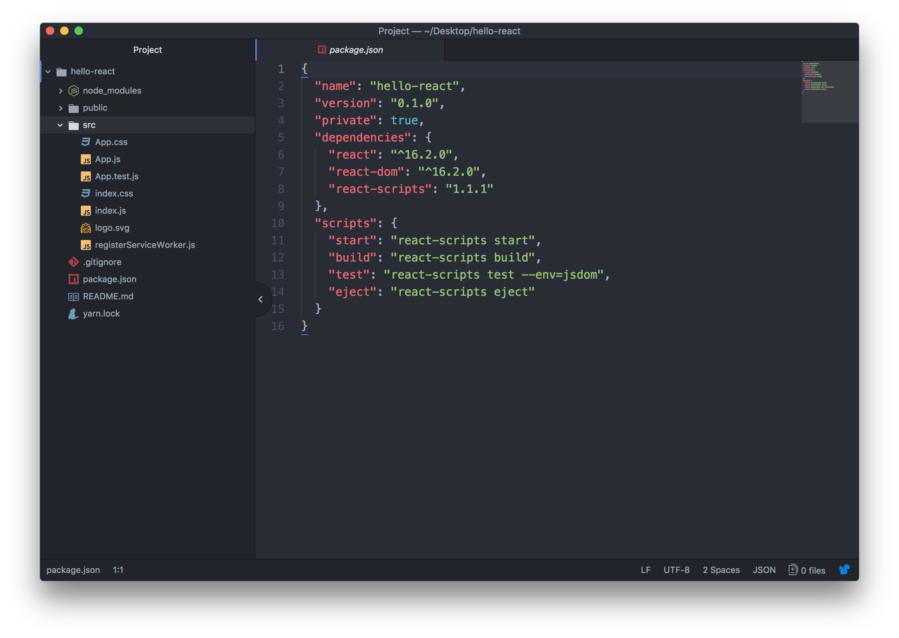
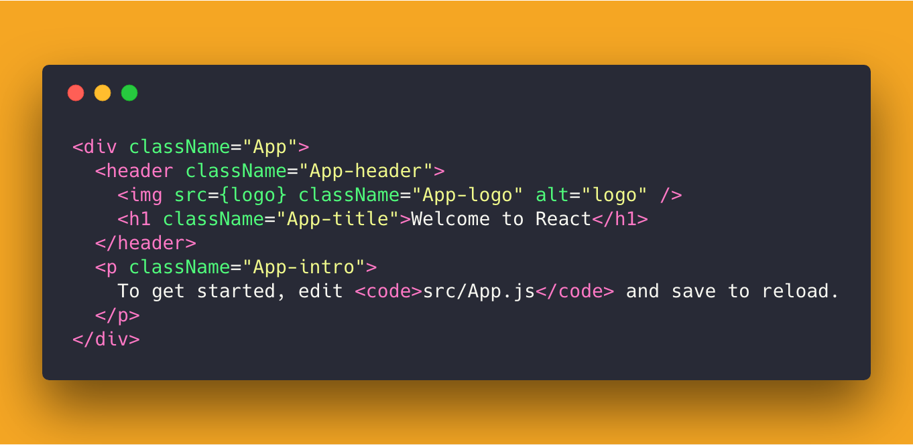

# 开始第一次尝试

React 主要是帮助你把你写的页面结构渲染到页面.

你需要告诉 react 这个页面有什么结构, 然后 react 会通过 JavaScript 帮助你生成 DOM, 插入到页面.

你只要描述出结构就可以了. 在 react 里面, 提供了一种帮助你描述页面结构的方法, 它叫 **JSX** ;

但是你需要事先配置一些环境来转换你写的 **JSX**.

你可以使用 _脚手架_ 来快速帮你生成一个项目, 它帮助你做好了相应的配置, 新建了一些事先的文件, 让你可以直接开始写代码而不需要担心环境配置的问题. 这是一个不错的开始.

你需要先安装 [node](https://nodejs.org/zh-cn/), 接着你就可以在命令行安装 `create-react-app`:

```
  npm i -g create-react-app
```
接着, 你就可以创建一个你的项目了:

```
  create-react-app hello-react
```
接下来, 用你的编辑器打开项目, 你会发现里面就已经有一些文件了, 并且它已经做好了配置:



在命令行, 使用 `cd hello-react` 就可以进入到项目的文件夹里面, 再运行 `npm start`, 你就会发现浏览器打开了一个新的页面, 项目也会运行起来.

打开`src`文件夹, 找到App.js这个文件, 你会看到类似如下代码:



是不是很像在写 `html`, 你可以修改一下里面的文字, 界面自动刷新了. wow, 你修改了第一行自己的 `react` 代码!!! :collision::fire::baby_chick::baby_chick::tada::tada:

:point_right::point_right: [下一节, 我们来看看项目是从哪开始的!](./1-EntryPoint.md)

[回到大纲](../README.md#outline) :point_left::point_left:
