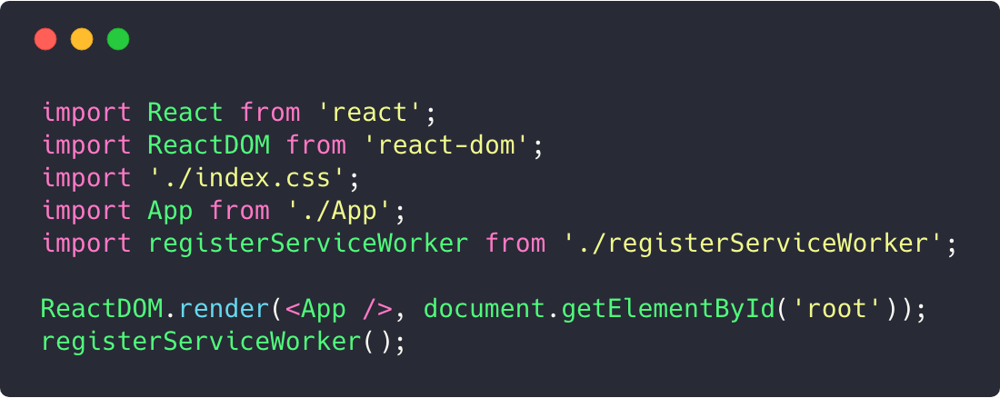
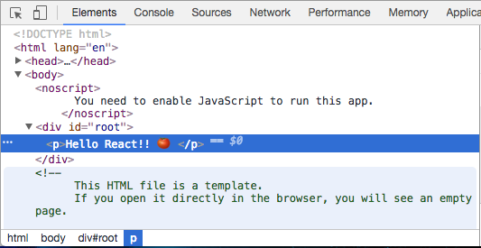

# React 运行起来最基本的组成

打开项目的 `src` 目录下的 `index.js` 文件, 这个文件就是程序的入口文件, 代码从这里开始.

打开 `index.js` 文件, 你会看到类似这样的代码:



你可能对现在这一堆代码有疑惑, 我们现在可以精简一下, 变成这样:


现在你会看到, 浏览器上输出的内容变成了这样:

`Hello React!! 🍅`

我们先看前两行代码, 引入了 `React` 和 `ReactDOM` 这两个 API.

```jsx
  import React from 'react';
  import ReactDOM from 'react-dom';
```

重要的部分从第 5 行开始, 我们调用了 `ReactDOM.render` 方法, 并传入了两个参数.

```jsx
  ReactDOM.render(
    <p>Hello React!! 🍅 </p>
    , document.getElementById('root')
  );
```

第一个参数类似 html 标签, 第二个参数是我们获取到的一个 `DOM` 节点.

它的意思是, 把第一个参数的结构, 插入到第二个参数获取到的节点里面. 所以就变成了我们在页面看到的样子.

你可以打开 `public` 文件夹, 看到 `index.html` 这个文件, 里面一个 `id` 是 `root` 的 `div`:

```jsx
  <div id="root"></div>
```

这就是我们获取到的节点.

而如果你打开浏览器, 通过调试器查看页面结构的时候, 你会发现我们把 第一个参数写的结构, 插入到了我们获取到的 div 里面:



**以下我要说的话是本节的重点, 你要记住了!!!:boom::boom::boom:**

我们在第一个参数写的类似 html 的东西, 叫做 **`JSX`**, 我们使用这种语法可以快速描述出一份结构.

```jsx
  <p>Hello React!! 🍅 </p>
```

一件事情是, 这并不是 js 语法, 浏览器运行它就会出错, 所以我们需要把它转换成 js 代码才能在浏览器运行.

而这个转换的工作, 在我们刚开始使用 npm start 启动项目的时候, 我们项目的开发环境配置已经帮我们在背后默默做了这件事情. (我们现在暂时放下环境配置方面的东西, 先不用去担心它).

第二个参数是一个 `dom` 节点, 我们把它叫做容器:

```js
  document.getElementById('root')
```

所以 `ReactDOM.render()` 方法总结起来一句话就概括:

**把你写的 jsx 结构插入到容器里面, 然后渲染到页面.**

大家可以试试在第一个参数里面像写 html 结构一样写自己想要的东西, 看看会发生什么事情.

点击按钮, 去试试:

[](https://codesandbox.io/s/2zp1623660)

---

:point_right::point_right: [下一节, 我们就去揭开 JSX 的神秘面纱! :tada::tada:](./2-JSX.md)

[回到大纲](../README.md#outline) :point_left::point_left:
