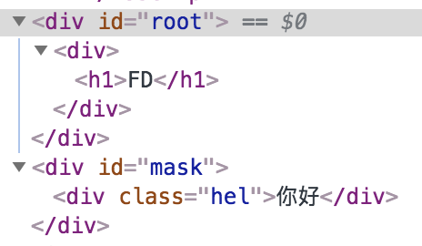

# Portals
美音:`/'pɔrtl/`

## 动机
#### `Model` 框

假设页面需要弹出一个 `Model` 框, 或者需要一个盖住页面的遮罩.

使用原生的方法我们很容易想到在一个稍微靠外的元素直接进行操作. 但是在 React 里面, 我们可能会在一个层级很靠内的地方触发 Model 的弹出. 但是要把 Model 插入一个比较靠外元素并非那么容易, 状态和事件可能需要流经多个组件.

#### overflow: hidden or z-index

如果规定容器溢出隐藏或者 z-index 比较小. 你可能想在容器外显示或者在最顶层显示.

## 使用 Portals

语法:

```js
ReactDOM.createPortal(child, container)
```
参数 `child`, 可以是任何可渲染的 `React child`.

参数 `container`, 是一个 DOM 元素.

比如:

```js

<div>
  <h1>FD</h1>
  {ReactDOM.createPortal(
    <div className="hel">你好</div>
    ,
    document.getElementById('mask')
  )}
</div>
```

这个时候, 类名 `hel` 的 `div`不会出现在 `h1` 下面, 而是会出现在 id 是 mask 这个元素里面.



## 事件冒泡

portal 依然存在 React DOM Tree 中, 所以它的行为和其它的 React child 表现是一样的, 包括事件冒泡.

> 注意: 即便 child 可能被插到不同的 DOM 中, 位置不定. 但是事件流安装 React dom Tree 工作.

---

:point_right::point_right:[下一节, Fragments](./15-ErrorBoundaries.md)

[回到大纲](../README.md#outline) :point_left::point_left:
