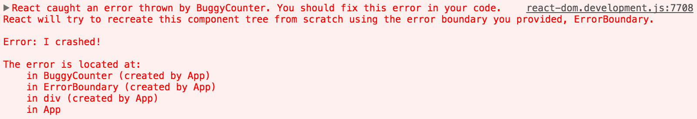
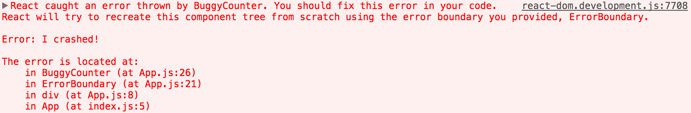

# 错误边界

UI 中抛出的错误会让程序奔溃.

错误边界是一个组件, 可以捕获子组件生命周期方法抛出的错误. 这个时候可以做一些 UI 回退的工作

> 注意
> 以下错误不会被捕获:
> - 事件回调
> - 异步执行的代码
> - 服务端渲染
> - 错误边界本身抛出的错误


实现了 `componentDidCatch（error，info）` 生命周期函数的组件就成为了错误边界.

```js
class ErrorBoundary extends React.Component {
  constructor(props) {
    super(props);
    this.state = { hasError: false };
  }

  componentDidCatch(error, info) {
    // Display fallback UI
    this.setState({ hasError: true });
    // You can also log the error to an error reporting service
    logErrorToMyService(error, info);
  }

  render() {
    if (this.state.hasError) {
      // You can render any custom fallback UI
      return <h1>Something went wrong.</h1>;
    }
    return this.props.children;
  }
}
```
只是实现了一个生命周期方法而已, 和普通的组件一样.

## componentDidCatch 参数

`error`: 捕获到的数据

`info`: 一个对象, 用于 componentStack 属性, 可以得到一些组件堆栈的信息.


## 行为

从 16 开始, 没有被错误边界处理的错误会导致整个组件树被卸载. 显示了崩坏的信息还不如不显示.

## 组件堆栈跟踪
对于 React 16, 即便在渲染过程中程序捕获的错误, 这些错误还是会被打印到控制台. 除了错误消息和JavaScript堆栈之外，它还提供组件堆栈跟踪。可以看到组件树中确切发生故障的位置:



您还可以查看组件堆栈跟踪中的文件名和行号。这在 Create React App 是默认开启的:



你可以使用[transform-react-jsx-source](https://www.npmjs.com/package/babel-plugin-transform-react-jsx-source) 插件自己开启这个功能. 记住只在开发阶段使用.

>显示在堆栈轨迹中的组件名称取决于Function.name属性。如果您支持旧式浏览器和尚未提供此功能的设备（例如IE 11），请在你打包的代码中包含 `Function.name polyfill`，如function.name-polyfill。或者，您可以在所有组件上显式设置displayName属性。

---

:point_right::point_right:[下一节, Fragments](./16-HOC.md)

[回到大纲](../README.md#outline) :point_left::point_left:
