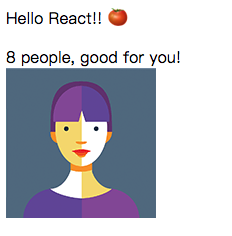

# 认识 JSX

JSX 是一直语法, 能够快速让你描述出一份 `DOM` 的结构.

它跟 `html` 很像, 但不是. 我们有过使用 `html` 的经历, 所以写起 JSX 来也很容易.

不过, `JSX` 能做的更多.

现在你就可以运行起我们之前使用 `create-react-app` 新建的项目, 打开 `src` 下的 `index.js` :

```js
import React from 'react';
import ReactDOM from 'react-dom';


ReactDOM.render(
  <p>Hello React!! 🍅 </p>
  , document.getElementById('root')
);

```

你也可以在这里在线调试:

<iframe src="https://codesandbox.io/embed/2zp1623660" style="width:100%; height:500px; border:0; border-radius: 4px; overflow:hidden;" sandbox="allow-modals allow-forms allow-popups allow-scripts allow-same-origin"></iframe>

开始了!:sparkles::sparkles::sparkles:

### 在 JSX 里可以使用表达式

在 `jsx` 里使用花括号 `{}` , 在 `{}` 里可以写 JavaScript 表达式, 比如:

```js
import React from 'react';
import ReactDOM from 'react-dom';

let exp = 'people';

let vol = <span> good for you!</span>;

ReactDOM.render(
  <div>
    <p>
      Hello React!! 🍅
    </p>
    <span> {5+3} {exp},</span>
    {vol}
    <br/>
    
  </div>
  , document.getElementById('root')
);

```

看看结果, `{}` 里的东西都变成了表达式的返回值. 甚至连 `JSX` 本身也可以被当做表达式.



你还可以发现别的事情, JSX 可以相互嵌套, 可以写属性.

和 `html` 真的很像.
