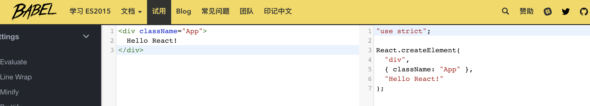

# 理解 JSX

事实上, `JSX` 会被一个 `babel` 的 编译器 转换成 `JavaScript` 代码.

比如下面这行 `JSX` 代码:

```jsx
<div className="App">
  Hello React!
</div>
```

你可以打开 `Bebel` 的 [:point_right::point_right:REPL](https://babel.docschina.org/repl/), 把这段代码复制过去, 看看转换后会变成什么.



可以看到, 转换后的代码变成了:

```jsx
React.createElement(
  "div",
  { className: "App" },
  "Hello React!"
);
```

它变成了一段标准的 `JavaScript` 代码.

调用了 `React.createElement()` 方法, 传入了一些参数.

这也是为什么当我们写 `JSX` 的时候, 必须要保证 `React` 这个变量出现在作用域内的原因.

这段代码运行之后会得到什么呢?

如果你去控制台打印一下, 你会发现得到一个对象. 是的!!!:100::100::100: 最终你会得到一个类似如下的对象:

```js
{
  type: 'div',
  props: {
    className: 'App',
    children: 'Hello React!'
  }
};
```
当然, 实际上你会得到一个复杂的多的对象, 但无论如何, **你只是得到了一个 普普通通的 JavaScript 对象.**

---

现在让你实现一个简化版的 `ReactDOM.render()` , 就没有那么难了.

你想想, 你拿到这个对象后, 先得到一个 type 的值 div , 于是你可以这样:

```js
  document.createElement('div')
```
就得到了一个 `div`.

接下来, 照葫芦画瓢, 通过 `DOM` 操作, 我相信肯定可以给这个新创建的 `div` 添加一个 `App` 的类名,

再往里面添加一段内容, `Hello React!` .

最关键的一步, 把你创建的 `div` , 插入到在 `ReactDOM.render()` 传入的第二个参数所获取到的容器节点.

怎么样, 其实使用 `react`, 并没有什么魔法的地方, 本质上, 还是在使用熟悉的 `JavaScript` 而已.

[下一节, 一起去认识组件](./5-Component.md)

[你也可以去一览 JSX 的细节, 也可以在今后再回过头去看](./4-JSX-doc.md)

[回到大纲:point_left::point_left:](../README.md#outline)
