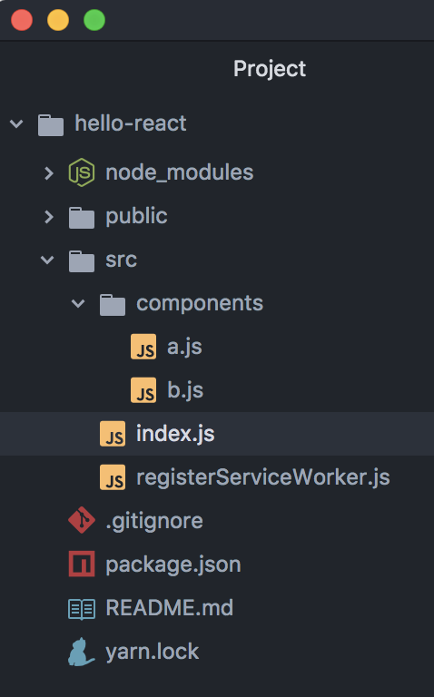

# 组件

一个页面是非常复杂的, 一个 web app, 就更加复杂了.

一个再庞大的页面, 你都可以把它拆分成一个个组件, 最后把这些组件进行组合, 就可以得到一个页面了.

## 声明组件的两种方式

#### 使用类声明 :cyclone::cyclone::cyclone:

如下就是一个合法的类式组件:

```jsx
class Welcome extends React.Component {
  render() {
    // jsx 可能占用多行, 所以用个括号包起.
    return (
      <div>Hello React!</div>
    );
  }
}
```

你只需要声明一个类, 这个类需要继承 `React.Component`.

接着, 这个类至少需要实现一个 `render()` 方法, `render` 方法里面返回一份 `JSX`.

#### 使用函数声明 :cyclone::cyclone::cyclone:

如下就是一个合法的函数式组件:
```jsx
function Welcome() {
  return (
    <div>Hello React!</div>
  );
}
```

写一个函数, 里面 `return` `JSX` ;

以上两种声明的方式都是可行的.

---

## 如何使用 :question::question::question:

查看如下代码:
```jsx
import React from 'react';
import ReactDOM from 'react-dom';

function A() {
  return (
    <p>Hello</p>
  )
}

function B() {
  return (
    <p>Flowke!</p>
  )
}


ReactDOM.render(
  <div>
    <A/>
    <B/>
  </div>
  , document.getElementById('root'));
```
`A`, `B` 两个组件, 只要把组件名当成标签就可以在 `JSX` 中任意组合了.

**有两点很重要::tomato: :tomato::tomato:**

- 自定义组件标签必须**大写开头**, 不然会被当成普通的内置 DOM 组件
- 当使用 `<A/>` 时, `A` 变量必须在作用域内.

如果能举一反三, 那下面代码也是可行的, 比如:

```jsx
import React from 'react';
import ReactDOM from 'react-dom';

function A() {
  return (
    <p>Hello</p>
  )
}

function B() {
  return (
    <div>
      <A/>
      <p>Flowke!</p>
    </div>
  )
}


ReactDOM.render(
  <div>
    <B/>
  </div>
  , document.getElementById('root'));
```

现在, `B` 组件嵌套了一个 `A` 组件. 这时, `B` 是 `A` 的父组件, `A` 是 `B` 的子组件了.

## 两种组件的不同

类组件和函数组件, 表现上都是一样的. 它们有各自的特点, **无所谓那种好, 那种不好!**

以下内容现在有点超纲了, 但是先熟悉一下也没什么不好.

两种组件还是有一些不同的地方的:

- 函数组件更为轻巧, 只负责渲染数据
- 类式组件有内部状态, 函数组件没有
- 类式有生命周期, 函数组件没有
- 类式组件有实例, 函数组件没有
- 接收 `props` 和 `contex` 的方式不同


## 组织代码的另一种方式

组织代码的时候, 你可以把组件存放在一个单独的文件里, 比如, 新建两个文件, `a.js`, `b.js`:



你可以把 A 组件写在 a.js 里面:

```jsx
import React from 'react';

export default function A() {
  return (
    <p>Hello</p>
  )
}
```
你可以把 B 组件写在 b.js 里面:

```jsx
import React from 'react';

export default function B() {
  return (
    <p>Flowke!</p>
  )
}
```

最后, 在 `index.js` 里面, 把这两个组件引入:

```jsx
import React from 'react';
import ReactDOM from 'react-dom';

import A from './components/a';
import B from './components/b';

ReactDOM.render(
  <div>
    <A/>
    <B/>
  </div>
  , document.getElementById('root'));
```
这样, 项目维护的时候, 就容易多了. :muscle::muscle::muscle:

---

:point_right::point_right: [下一节, 看看在组件元素里写属性](./6-Props.md)

[回到大纲](../README.md#outline) :point_left::point_left:
