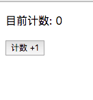
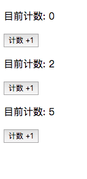

# State: 内部状态
话说在前, 在我们使用 `create-react-app` 生成的项目上 或 在 codesandbox 上在线调试代码: :point_down::point_down:

 [](https://codesandbox.io/s/new)

---

**确定一个共识: 类组件才有内部状态!** :exclamation::exclamation::exclamation:

一个组件在某些时候需要作出一些改变. 它不可能总是一成不变的.

比如一个计数器, 在某一次点击过后, 现实的数字就会改变; 再比如一个时钟程序, 现实的数字随着时间变动.

现在我们尝试做一个计数器看看.

这是我们的基础代码:

```jsx
import React from 'react';
import ReactDOM from 'react-dom';

class Counter extends React.Component{

  render(){
    return (
      <div>
        <p>目前计数: 0</p>
        <button>计数 +1</button>
      </div>
    )
  }
}

ReactDOM.render(
  <Counter/>
  , document.getElementById('root')
);
```

`Counter` 组件现在渲染之后是这个样子的:



## 给组件添加状态

现在我们改造一下 Counter 组件:

```jsx
class Counter extends React.Component{

  constructor(props){
    super(props);
    this.state= {
      count: 0
    };
  }

  render(){

    let { count } = this.state;

    return (
      <div>
        <p>目前计数: {count}</p>
        <button>计数 +1</button>
      </div>
    )
  }
}
```

#### 定义状态

我们首先增加了构造函数 `constructor()`:

```js
constructor(props){
  super(props);
  this.state = {
    count: 0
  };
}
```

构造函数接收的第一个参数就是我们之前学的 `props`;

我们先使用 `super(props);` 把组件的 `props` 传给父类的构造函数, 否则在构造函数里, 即便传递了 `props`, `this.props` 的值也会是 `undefined`.

**最关键的:** :boom::boom:

我们组件的实例上赋予了一个 `state` 变量. 并让它的值是一个对象.

`state` 的值, 要么是一个对象: `{}`, 要么是 `null`.

这样, 组件便有了一个内部状态.

#### 使用状态

在类的任何地方, 我们都可以通过组件实例拿到这个状态并使用.

比如在 `render()` 方法里面:

```jsx
render(){

  let { count } = this.state;

  return (
    <div>
      <p>目前计数: {count}</p>
      <button>计数 +1</button>
    </div>
  )
}

```

我们访问了 `this.state.count` 的值, 并渲染了它.

## 改变状态

现在我们想做一件事情, 点击按钮, `count` 的值就 +1.

我们需要先给按钮添加一个点击事件:

```jsx
render(){

    let { count } = this.state;

    return (
      <div>
        <p>目前计数: {count}</p>
        <button
          onClick={()=>{
            this.setState({
              count: count +1
            })
          }}
        >计数 +1</button>
      </div>
    )
  }
```

现在你点击按钮, 就会发现数字会出现变化.

这里有一些关键点:

添加事件我们会在后面详细说, 现在简单说一下, 给元素一个 `onClick` 的属性, 就添加了点击事件, 事件接收一个回调函数.

**要想改变 `count` 的值, 你不能直接修改 `this.state`, 而应该使用组件实例的 `this.setState()` 接口.** :bell::bell::bell:

另外, 如果你的 `state` 属性很多, 比如:

```js
state= {
  count: 0,
  c1: 0,
  c2: 0
};
```

如果你只想改变 `c1` 的值, 那么只需:

```js
this.setState({
  c1: 2
})
```
就可以了.

## 何为内部状态

如果你渲染多个 `Counter` 的实例:

```jsx

ReactDOM.render(
  <div>
    <Counter/>
    <Counter/>
    <Counter/>
  </div>

  , document.getElementById('root')
);

```
点击不同的按钮, 查看界面:



你会发现, 组件实例之间的状态互不影响. 这也是为什么我们把组件的 `state` 称为内部状态.

---

:point_right::point_right:[下一节, 看看 State 更深入的特性](./8-State-other-features.md)

[回到大纲](../README.md#outline) :point_left::point_left:
