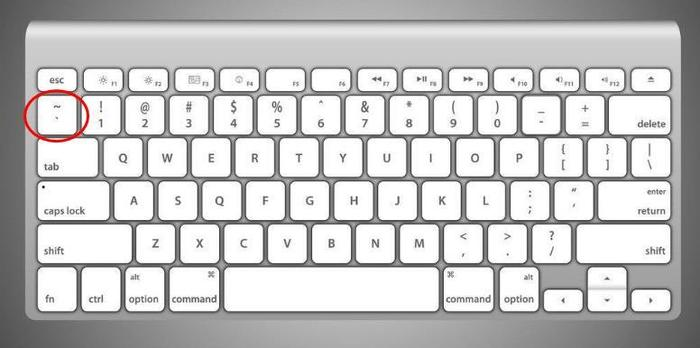

# 模板字符串

原来使用 单引号 或者 双引号 来写字符串. 现在有了一个新的写字符串的语法, 就是使用 ESC 键下面的那个反引号:




使用这个符号来定义一个字符串字面量, 就得到一个普普通通的字符串而已. 和原来没有什么区别:

```js
`我是模板字符串`
```

但是, 你可以在它里面插入表达式, 为我们提供了一种更优雅拼接字符串的方式, 比如:

```js
let firstName = 'Flowke';
let lastName = 'Hurley';

let fullName = `Hello ${firstName} ${lastName} !`

console.log(fullName); // 打印: Hello Flowke Hurley !

function getName(){
  return 'Jack';
}

console.log(`你好, ${getName()} !`) // 打印 你好 Jack !

```

在里面写一个 `${}` , 接着在花括号里面写表达式. 结果就会被替换成表达式的结果.

---

:point_right::point_right:[下一节, 我们看看变量的解构赋值](./3-Destruct-var.md)

[回到大纲](../README.md#outline) :point_left::point_left:
